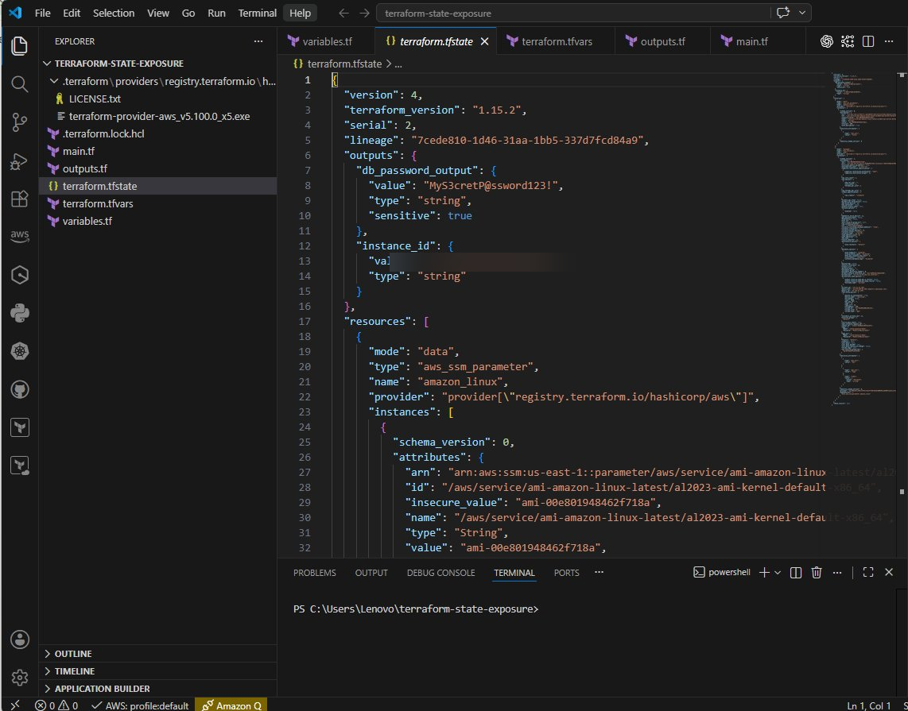

# Terraform State Exposure Lab



This lab demonstrates why `sensitive = true` is not enough and how Terraform 1.10+ ephemeral values help protect secrets from being written to state.

## Overview


This repository demonstrates a common Terraform security risk: sensitive values being stored in Terraform state files.

Many engineers assume that storing secrets in AWS Systems Manager Parameter Store, AWS Secrets Manager, Azure Key Vault, or HashiCorp Vault completely protects those secrets. However, Terraform may still write secret values to the state file.

This lab shows:

* How secrets can appear in `terraform.tfstate`
* Why `sensitive = true` is not sufficient protection
* How Terraform Ephemeral Values help reduce exposure
* Best practices for securing Terraform state

---
## Key Finding

Terraform's `sensitive = true` hides values from CLI output, but does **not** prevent those values from being written to the Terraform state file.

Terraform 1.10+ introduces **ephemeral values**, which can prevent sensitive values from being stored in state when used with supported workflows.

## Project Structure

```text
.
├── main.tf
├── variables.tf
├── outputs.tf
├── .gitignore
└── README.md
```

---

## The Problem

Example variable:

```hcl
variable "db_password" {
  type      = string
  sensitive = true
}
```

Many users believe this prevents the password from being stored anywhere.

It does not.

The `sensitive` argument only hides values from Terraform CLI output.

The value may still exist inside:

* terraform.tfstate
* state backups
* remote state backends

---

## Demonstration

Initialize Terraform:

```bash
terraform init
```

Apply configuration:

```bash
terraform apply
```

Inspect the state file:

```bash
cat terraform.tfstate
```

or

```bash
grep -i "password" terraform.tfstate
```

Observe how Terraform stores resource attributes and sensitive values in state.

---

## Mitigation with Ephemeral Values

Terraform 1.10 introduced Ephemeral Values.

Example:

```hcl
variable "db_password" {
  type      = string
  sensitive = true
  ephemeral = true
}
```

Ephemeral values are not written to:

* Terraform state files
* Terraform plan files

This significantly reduces the risk of secret exposure.

---

## Security Recommendations

* Never commit state files to GitHub
* Use encrypted remote state backends
* Restrict access to state storage
* Use ephemeral values where supported
* Rotate exposed credentials immediately

---

## Learning Objectives

After completing this lab, you should understand:

* Terraform state fundamentals
* Secret exposure risks
* The limitations of `sensitive = true`
* The benefits of ephemeral values
* Terraform state security best practices

---

## Author

Alexander Njoku
https://www.linkedin.com/in/alexander-njoku-62040a194/
https://medium.com/@alex2020global
